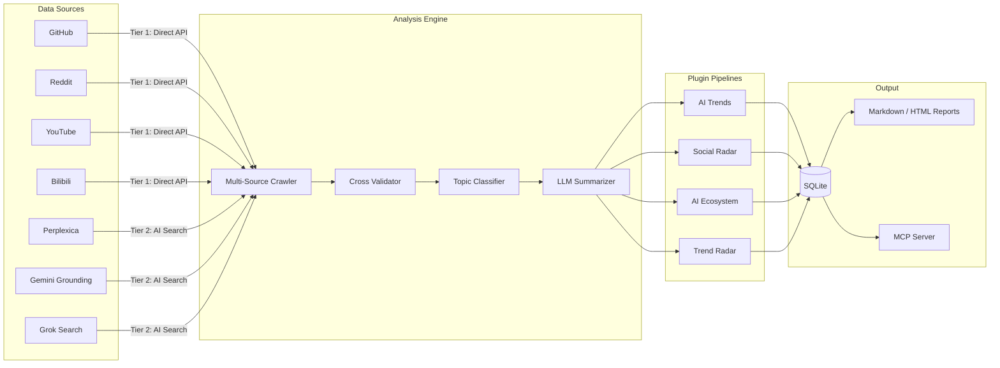

# Hermit Purple

**Open-Source AI Trend Monitoring Tool**

[](https://creativecommons.org/licenses/by-nc/4.0/)
[](https://www.python.org/)
[](https://github.com/AtsushiHarimoto/Moyin-Factory)

🌏 **Languages:** [English](README.md) | [日本語](docs/README.ja.md) | [繁體中文](docs/README.zh-TW.md)

Hermit Purple is a plugin-based, read-only research tool that aggregates public discussions from multiple platforms, cross-validates findings through multi-engine AI search, and generates personal weekly summaries using LLMs.

A non-commercial side project for anyone who wants to keep up with fast-moving AI/tech trends without drowning in noise.

---

## Architecture



### Data Flow

1. **Multi-Source Crawling** -- Tier 1 (direct API) and Tier 2 (AI-powered search) sources are queried in parallel
2. **Cross-Validation** -- URL normalization, title deduplication, and multi-engine citation counting produce a confidence score
3. **LLM Classification** -- Each result is evaluated by an LLM (Gemini / Grok / Ollama) that assigns a maturity label (Adopt / Trial / Assess / Hold) with brief rationale
4. **Topic Extraction** -- Public post titles and text are categorized by topic, community interest level, and recurring themes
5. **Report Synthesis** -- An LLM summarizer generates weekly Markdown reports with key trends and notable projects

---

## Key Technical Decisions

| Decision | Rationale |
|---|---|
| **Plugin Architecture** | Each analysis domain (AI Trends, Social Radar, AI Ecosystem, Trend Radar) is a self-contained plugin with event callbacks. New pipelines are added by subclassing `HermitPlugin` -- zero core changes required. |
| **Tiered Source Registry** | Sources are classified into Tier 1 (direct API), Tier 2 (AI search engines), and Tier 3 (web crawlers). The registry pattern enables health-checking and fallback chains. |
| **Cross-Engine Validation** | Results from Perplexica, Gemini Grounding, and Grok Search are cross-validated by URL normalization and title similarity. Items confirmed by 2+ engines receive a confidence boost. |
| **Prompt Anti-Fingerprinting** | The `PromptPermutator` rotates personas, task phrasings, and output format directives to avoid repetitive API signatures. |
| **Rate Limit Guard** | File-lock-based `UsageGuard` prevents runaway API costs with per-day limits, safe for concurrent processes. |
| **Resilient AI Calls** | Dual-path LLM access: local gateway (Web2API) with automatic fallback to official Gemini/Grok APIs on gateway errors. |
| **MCP Server** | Exposes all capabilities (scrape, audit, report, search) as MCP tools, enabling integration with Claude, Stitch, and other MCP clients. |
| **SQLite + SQLAlchemy** | Zero-config persistence with full ORM. Resource deduplication is enforced at the database level via unique compound indexes. |

---

## Quick Start

### 1. Install

```bash
git clone https://github.com/AtsushiHarimoto/hermit-purple.git
cd hermit-purple
python -m venv venv
source venv/bin/activate  # Windows: venv\Scripts\activate
pip install -r requirements.txt
```

### 2. Configure

Copy the example environment file and fill in your API keys:

```bash
cp .env.example .env
```

```ini
# .env
AI_BASE_URL=http://localhost:9009/v1     # Local gateway or OpenAI-compatible endpoint
AI_API_KEY=your-ai-api-key-here
AI_MODEL=gemini-3.0-pro

GITHUB_TOKEN=your-github-token           # For GitHub API access
GEMINI_API_KEY=your-gemini-api-key-here  # Official Gemini API (fallback)
```

Review `config.yaml` for platform-specific settings (subreddits, min stars, keyword presets, etc.).

### 3. Run

```bash
# Check system health
python -m src.interface.cli health

# List available analysis plugins
python -m src.interface.cli list

# Run AI trend analysis
python -m src.interface.cli run ai_trends

# Smart web search with multi-engine fallback
python -m src.interface.cli search "latest AI agent frameworks 2025"

# Check search chain health (gateway, internet, Perplexity, Google)
python -m src.interface.cli search-health
```

### 4. MCP Server

Run as an MCP server for integration with Claude Code or other MCP clients:

```bash
python -m src.mcp_server
```

Available MCP tools: `scrape_ai_trends`, `audit_resource`, `run_ai_curator`, `generate_weekly_report`, `discover_trending_keywords`, `smart_web_search`, `smart_web_health`

---

## Project Structure

```
hermit-purple/
|-- src/
|   |-- core/                # Core engines
|   |   |-- plugin.py        #   Plugin base class & manager
|   |   |-- llm.py           #   LLM summarizer (maturity scoring)
|   |   |-- sentiment.py     #   Topic & interest extraction
|   |   |-- guard.py         #   Rate limit defense (file-lock based)
|   |   |-- prompt_engine.py #   Anti-fingerprinting prompt permutator
|   |   +-- config.py        #   Pydantic config & env settings
|   |-- sources/             # Data source adapters
|   |   |-- registry.py      #   Source discovery & tier management
|   |   |-- cross_validator.py # Multi-engine cross-validation
|   |   |-- github.py        #   GitHub API source
|   |   |-- reddit.py        #   Reddit API source
|   |   |-- youtube.py       #   YouTube source
|   |   |-- bilibili.py      #   Bilibili source
|   |   |-- perplexica.py    #   Perplexica AI search (self-hosted)
|   |   |-- gemini_grounding.py # Gemini with grounding
|   |   +-- grok_search.py   #   Grok web search
|   |-- plugins/             # Analysis pipelines (auto-discovered)
|   |   |-- ai_trends/       #   AI/ML trend tracking
|   |   |-- social_radar/    #   Community discussion tracking
|   |   |-- ai_business/     #   AI ecosystem & tooling landscape
|   |   +-- trend_radar/     #   Emerging technology radar
|   |-- scrapers/            # Platform-specific crawlers
|   |-- pipelines/           # Pipeline base & registry
|   |-- services/            # Smart search & content auditor
|   |-- report/              # Markdown/HTML report generator (Jinja2)
|   |-- db/                  # SQLAlchemy models & session management
|   |-- interface/           # Typer CLI application
|   |-- infra/               # Crawler & storage infrastructure
|   |-- mcp_server.py        # MCP server (FastMCP)
|   +-- config.py            # App-level config loader
|-- prompts/                 # LLM prompt templates (per pipeline)
|-- tests/                   # Unit & integration tests
|-- config.yaml              # Platform & pipeline configuration
|-- requirements.txt         # Python dependencies
+-- .env.example             # Environment variable template
```

---

## Extending with Plugins

1. Create a new directory under `src/plugins/your_plugin/`
2. Add an `__init__.py` that exports a class inheriting from `HermitPlugin`
3. Implement `name`, `description` properties and the `run(context)` method
4. The `PluginManager` auto-discovers plugins at startup -- no registration needed

```python
from src.core.plugin import HermitPlugin, PipelineResult

class MyPlugin(HermitPlugin):
    @property
    def name(self) -> str:
        return "my_plugin"

    @property
    def description(self) -> str:
        return "Custom analysis pipeline"

    def run(self, context: dict) -> PipelineResult:
        # Your analysis logic here
        self.emit("status", "Running analysis...")
        return PipelineResult(success=True, data={"result": "done"})
```

---

## Part of the Moyin Ecosystem

Hermit Purple is the trend-monitoring component of [Moyin Factory](https://github.com/AtsushiHarimoto/Moyin-Factory), an AI-powered visual novel engine ecosystem.

| Component | Role |
|---|---|
| **Moyin Factory** | Core visual novel engine (Vue 3 + TypeScript) |
| **Hermit Purple** | AI trend monitoring & weekly summaries (this repo) |
| **Moyin Gateway** | LLM API gateway (Gemini / Grok reverse proxy) |

---

## License

This project is licensed under [CC BY-NC 4.0](LICENSE) (Creative Commons Attribution-NonCommercial 4.0 International).

You are free to share and adapt this work for non-commercial purposes with appropriate attribution.

---

*Built with Python asyncio, SQLAlchemy, Typer, Pydantic, OpenAI SDK, FastMCP, and Jinja2.*
