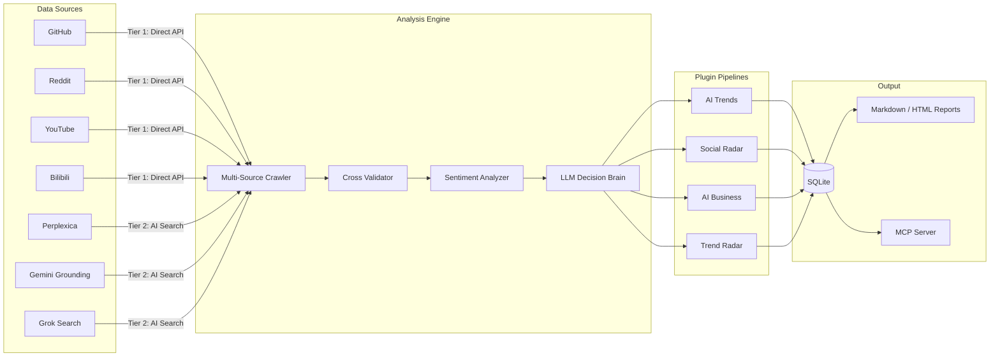

# Hermit Purple

**AI Trend Research & Decision Support System**

[](https://creativecommons.org/licenses/by-nc/4.0/)
[](https://www.python.org/)
[](https://github.com/AtsushiHarimoto/Moyin-Factory)

Hermit Purple is a plugin-based AI trend research tool that crawls multiple platforms, cross-validates findings through multi-engine AI search, and synthesizes structured intelligence reports using LLMs.

Built for developers and teams who need to stay ahead of fast-moving AI/tech trends without drowning in noise.

---

## Architecture



### Data Flow

1. **Multi-Source Crawling** -- Tier 1 (direct API) and Tier 2 (AI-powered search) sources are queried in parallel
2. **Cross-Validation** -- URL normalization, title deduplication, and multi-engine citation counting produce a confidence score
3. **LLM Analysis** -- Each result is evaluated by a Decision Brain (Gemini / Grok / Ollama) that assigns a verdict (Adopt / Trial / Assess / Hold) with evidence and risk notes
4. **Sentiment Extraction** -- Social media comments are analyzed for commercial signals, willingness-to-pay, and pain points
5. **Report Synthesis** -- An AI "editor-in-chief" generates weekly Markdown reports with executive summaries, key trends, and spotlight tools

---

## Key Technical Decisions

| Decision | Rationale |
|---|---|
| **Plugin Architecture** | Each analysis domain (AI Trends, Social Radar, AI Business, Trend Radar) is a self-contained plugin with event callbacks. New pipelines are added by subclassing `HermitPlugin` -- zero core changes required. |
| **Tiered Source Registry** | Sources are classified into Tier 1 (direct API), Tier 2 (AI search engines), and Tier 3 (web crawlers). The registry pattern enables health-checking and fallback chains. |
| **Cross-Engine Validation** | Results from Perplexica, Gemini Grounding, and Grok Search are cross-validated by URL normalization and title similarity. Items confirmed by 2+ engines receive a confidence boost. |
| **Prompt Anti-Fingerprinting** | The `PromptPermutator` rotates personas, task phrasings, and output format directives to avoid repetitive API signatures. |
| **Rate Limit Guard** | File-lock-based `UsageGuard` prevents runaway API costs with per-day limits, safe for concurrent processes. |
| **Resilient AI Calls** | Dual-path LLM access: local gateway (Web2API) with automatic fallback to official Gemini/Grok APIs on gateway errors. |
| **MCP Server** | Exposes all capabilities (scrape, audit, report, search) as MCP tools, enabling integration with Claude, Stitch, and other MCP clients. |
| **SQLite + SQLAlchemy** | Zero-config persistence with full ORM. Resource deduplication is enforced at the database level via unique compound indexes. |

---

## Quick Start

### 1. Install

```bash
git clone https://github.com/AtsushiHarimoto/hermit-purple.git
cd hermit-purple
python -m venv venv
source venv/bin/activate  # Windows: venv\Scripts\activate
pip install -r requirements.txt
```

### 2. Configure

Copy the example environment file and fill in your API keys:

```bash
cp .env.example .env
```

```ini
# .env
AI_BASE_URL=http://127.0.0.1:9009/v1    # Local gateway or OpenAI-compatible endpoint
AI_API_KEY=your-api-key
AI_MODEL=gemini-2.5-flash

GITHUB_TOKEN=ghp_your_token              # For GitHub API access
GEMINI_API_KEY=your-gemini-key           # Official Gemini API (fallback)
```

Review `config.yaml` for platform-specific settings (subreddits, min stars, keyword presets, etc.).

### 3. Run

```bash
# Check system health
python -m src.interface.cli health

# List available analysis plugins
python -m src.interface.cli list

# Run AI trend analysis
python -m src.interface.cli run ai_trends

# Smart web search with multi-engine fallback
python -m src.interface.cli search "latest AI agent frameworks 2025"

# Check search chain health (gateway, internet, Perplexity, Google)
python -m src.interface.cli search-health
```

### 4. MCP Server

Run as an MCP server for integration with Claude Code or other MCP clients:

```bash
python -m src.mcp_server
```

Available MCP tools: `scrape_ai_trends`, `audit_resource`, `run_ai_curator`, `generate_weekly_report`, `discover_trending_keywords`, `smart_web_search`, `smart_web_health`

---

## Project Structure

```
hermit-purple/
|-- src/
|   |-- core/                # Core engines
|   |   |-- plugin.py        #   Plugin base class & manager
|   |   |-- llm.py           #   LLM Decision Brain (verdict scoring)
|   |   |-- sentiment.py     #   Commercial signal extraction
|   |   |-- guard.py         #   Rate limit defense (file-lock based)
|   |   |-- prompt_engine.py #   Anti-fingerprinting prompt permutator
|   |   +-- config.py        #   Pydantic config & env settings
|   |-- sources/             # Data source adapters
|   |   |-- registry.py      #   Source discovery & tier management
|   |   |-- cross_validator.py # Multi-engine cross-validation
|   |   |-- github.py        #   GitHub API source
|   |   |-- reddit.py        #   Reddit API source
|   |   |-- youtube.py       #   YouTube source
|   |   |-- bilibili.py      #   Bilibili source
|   |   |-- perplexica.py    #   Perplexica AI search (self-hosted)
|   |   |-- gemini_grounding.py # Gemini with grounding
|   |   +-- grok_search.py   #   Grok web search
|   |-- plugins/             # Analysis pipelines (auto-discovered)
|   |   |-- ai_trends/       #   AI/ML trend tracking
|   |   |-- social_radar/    #   Social media sentiment
|   |   |-- ai_business/     #   Monetization & competitor analysis
|   |   +-- trend_radar/     #   Emerging technology radar
|   |-- scrapers/            # Platform-specific crawlers
|   |-- pipelines/           # Pipeline base & registry
|   |-- services/            # Smart search & content auditor
|   |-- report/              # Markdown/HTML report generator (Jinja2)
|   |-- db/                  # SQLAlchemy models & session management
|   |-- interface/           # Typer CLI application
|   |-- infra/               # Crawler & storage infrastructure
|   |-- mcp_server.py        # MCP server (FastMCP)
|   +-- config.py            # App-level config loader
|-- prompts/                 # LLM prompt templates (per pipeline)
|-- tests/                   # Unit & integration tests
|-- config.yaml              # Platform & pipeline configuration
|-- requirements.txt         # Python dependencies
+-- .env.example             # Environment variable template
```

---

## Extending with Plugins

1. Create a new directory under `src/plugins/your_plugin/`
2. Add an `__init__.py` that exports a class inheriting from `HermitPlugin`
3. Implement `name`, `description` properties and the `run(context)` method
4. The `PluginManager` auto-discovers plugins at startup -- no registration needed

```python
from src.core.plugin import HermitPlugin, PipelineResult

class MyPlugin(HermitPlugin):
    @property
    def name(self) -> str:
        return "my_plugin"

    @property
    def description(self) -> str:
        return "Custom analysis pipeline"

    def run(self, context: dict) -> PipelineResult:
        # Your analysis logic here
        self.emit("status", "Running analysis...")
        return PipelineResult(success=True, data={"result": "done"})
```

---

## Part of the Moyin Ecosystem

Hermit Purple is the intelligence-gathering component of [Moyin Factory](https://github.com/AtsushiHarimoto/Moyin-Factory), an AI-powered visual novel engine ecosystem.

| Component | Role |
|---|---|
| **Moyin Factory** | Core visual novel engine (Vue 3 + TypeScript) |
| **Hermit Purple** | AI trend research & decision support (this repo) |
| **Moyin Gateway** | LLM API gateway (Gemini / Grok reverse proxy) |

---

## License

This project is licensed under [CC BY-NC 4.0](LICENSE) (Creative Commons Attribution-NonCommercial 4.0 International).

You are free to share and adapt this work for non-commercial purposes with appropriate attribution.

---

<details>
<summary><strong>Japanese (日本語)</strong></summary>

## Hermit Purple - AI トレンドリサーチ＆意思決定支援システム

Hermit Purple は、プラグインベースの AI トレンドリサーチツールです。複数プラットフォームをクロールし、マルチエンジン AI 検索による交差検証を行い、LLM を活用して構造化されたインテリジェンスレポートを生成します。

### 主な特徴

- **プラグインアーキテクチャ**: AI Trends、Social Radar、AI Business、Trend Radar の各分析ドメインが独立したプラグインとして実装
- **マルチソースクローリング**: GitHub、Reddit、YouTube、Bilibili から直接 API で取得。Perplexica、Gemini、Grok による AI 検索で補完
- **交差検証エンジン**: URL 正規化、タイトル類似度によるデデュプリケーション、複数エンジンの引用カウントで信頼度スコアを算出
- **LLM 判定ブレイン**: 各結果を Adopt / Trial / Assess / Hold の4段階で評価。エビデンスとリスクノート付き
- **センチメント分析**: ソーシャルメディアのコメントから商業的シグナル（支払い意欲、ペインポイント）を抽出
- **MCP サーバー統合**: Claude Code や Stitch などの MCP クライアントとネイティブ連携
- **レート制限ガード**: ファイルロックベースの UsageGuard で API コスト暴走を防止

### クイックスタート

```bash
git clone https://github.com/AtsushiHarimoto/hermit-purple.git
cd hermit-purple
python -m venv venv
source venv/bin/activate
pip install -r requirements.txt
cp .env.example .env  # API キーを設定
python -m src.interface.cli health
python -m src.interface.cli run ai_trends
```

### 技術スタック

Python 3.11+ / asyncio / SQLAlchemy + SQLite / Typer CLI / Pydantic / OpenAI SDK / FastMCP / Jinja2

</details>

<details>
<summary><strong>Traditional Chinese (繁體中文)</strong></summary>

## Hermit Purple - AI 趨勢研究與決策支援系統

Hermit Purple 是一款基於插件架構的 AI 趨勢研究工具。它從多個平台抓取資料，透過多引擎 AI 搜索進行交叉驗證，並利用 LLM 合成結構化的情報週報。

### 核心特色

- **插件架構**: AI Trends、Social Radar、AI Business、Trend Radar 各分析領域皆為獨立插件，新增分析管道只需繼承 `HermitPlugin`，無需修改核心代碼
- **多源爬取**: 透過直接 API 存取 GitHub、Reddit、YouTube、Bilibili（Tier 1），並以 Perplexica、Gemini Grounding、Grok Search 等 AI 搜索引擎（Tier 2）進行補充
- **交叉驗證引擎**: URL 正規化、標題相似度去重、多引擎引用計數，計算信心分數
- **LLM 決策大腦**: 每項結果由 AI 評估為 Adopt / Trial / Assess / Hold 四個等級，附帶證據摘要與風險備註
- **情感分析**: 從社群媒體評論中萃取商業信號（付費意願、痛點、需求信號）
- **MCP 伺服器整合**: 所有功能以 MCP 工具形式暴露，可與 Claude Code、Stitch 等 MCP 客戶端原生對接
- **速率限制防護**: 基於檔案鎖的 UsageGuard 機制，防止 API 成本失控，支援多行程安全

### 快速開始

```bash
git clone https://github.com/AtsushiHarimoto/hermit-purple.git
cd hermit-purple
python -m venv venv
source venv/bin/activate
pip install -r requirements.txt
cp .env.example .env  # 設定 API 金鑰
python -m src.interface.cli health
python -m src.interface.cli run ai_trends
```

### 技術棧概覽

| 模組 | 技術 |
|---|---|
| 插件系統 | AI Trends、Social Radar、AI Business、Trend Radar |
| 資料來源 | GitHub、Reddit、YouTube、Bilibili |
| AI 搜索引擎 | Perplexica、Gemini Grounding、Grok Search |
| LLM 整合 | Gemini API / Grok API / Ollama（OpenAI 相容介面） |
| 交叉驗證 | URL 正規化 + 標題相似度 + 多引擎引用計數 |
| 持久化 | SQLite + SQLAlchemy ORM |
| MCP 伺服器 | FastMCP 框架 |
| CLI 介面 | Typer + Rich |
| 反指紋 | PromptPermutator 動態提示詞排列 |

### 隸屬 Moyin 生態系

Hermit Purple 是 [Moyin Factory](https://github.com/AtsushiHarimoto/Moyin-Factory) AI 視覺小說引擎生態系的情報收集組件。

</details>

---

*Built with Python asyncio, SQLAlchemy, Typer, Pydantic, OpenAI SDK, FastMCP, and Jinja2.*
