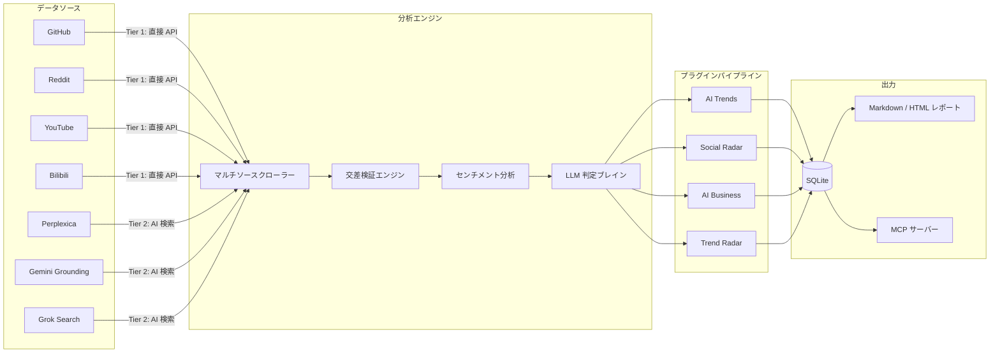

# Hermit Purple

**AI トレンドリサーチ＆意思決定支援システム**

[](https://creativecommons.org/licenses/by-nc/4.0/)
[](https://www.python.org/)
[](https://github.com/AtsushiHarimoto/Moyin-Factory)

🌏 **言語:** [English](../README.md) | [日本語](README.ja.md) | [繁體中文](README.zh-TW.md)

Hermit Purple は、プラグインベースの AI トレンドリサーチツールです。複数プラットフォームをクロールし、マルチエンジン AI 検索による交差検証を行い、LLM を活用して構造化されたインテリジェンスレポートを生成します。

AI・テクノロジーの急速なトレンド変化を追いかける開発者やチームのために設計されています。ノイズに埋もれることなく、本当に重要な情報だけを効率的に収集・分析します。

---

## アーキテクチャ



### データフロー

1. **マルチソースクローリング** -- Tier 1（直接 API）と Tier 2（AI 検索エンジン）のソースを並列でクエリ実行
2. **交差検証** -- URL 正規化、タイトル重複排除、マルチエンジン引用カウントにより信頼度スコアを算出
3. **LLM 分析** -- 各結果を Decision Brain（Gemini / Grok / Ollama）が評価し、Adopt / Trial / Assess / Hold の判定を付与。エビデンスとリスクノートを添付
4. **センチメント抽出** -- ソーシャルメディアのコメントから商業的シグナル（支払い意欲、ペインポイント）を分析
5. **レポート合成** -- AI「編集長」が、エグゼクティブサマリー・主要トレンド・注目ツールを含む週次 Markdown レポートを生成

---

## 主要な技術的判断

| 判断 | 根拠 |
|---|---|
| **プラグインアーキテクチャ** | 各分析ドメイン（AI Trends、Social Radar、AI Business、Trend Radar）はイベントコールバック付きの独立プラグイン。`HermitPlugin` を継承するだけで新しいパイプラインを追加可能。コア変更は一切不要。 |
| **階層型ソースレジストリ** | ソースを Tier 1（直接 API）、Tier 2（AI 検索エンジン）、Tier 3（Web クローラー）に分類。レジストリパターンによりヘルスチェックとフォールバックチェーンを実現。 |
| **クロスエンジン検証** | Perplexica、Gemini Grounding、Grok Search の結果を URL 正規化とタイトル類似度で交差検証。2 つ以上のエンジンで確認された項目は信頼度ブーストを取得。 |
| **プロンプト反フィンガープリンティング** | `PromptPermutator` がペルソナ、タスクの言い回し、出力形式指示をローテーションし、反復的な API シグネチャを回避。 |
| **レート制限ガード** | ファイルロックベースの `UsageGuard` が日次制限で API コスト暴走を防止。並行プロセスに対応。 |
| **耐障害 AI コール** | デュアルパス LLM アクセス：ローカルゲートウェイ（Web2API）を優先し、ゲートウェイエラー時に公式 Gemini/Grok API へ自動フォールバック。 |
| **MCP サーバー** | スクレイプ、監査、レポート、検索の全機能を MCP ツールとして公開。Claude、Stitch、その他 MCP クライアントとの統合を実現。 |
| **SQLite + SQLAlchemy** | ゼロコンフィグの永続化と完全な ORM。ユニーク複合インデックスによりデータベースレベルでリソースの重複を排除。 |

---

## クイックスタート

### 1. インストール

```bash
git clone https://github.com/AtsushiHarimoto/hermit-purple.git
cd hermit-purple
python -m venv venv
source venv/bin/activate  # Windows: venv\Scripts\activate
pip install -r requirements.txt
```

### 2. 設定

環境変数ファイルのテンプレートをコピーし、API キーを入力してください：

```bash
cp .env.example .env
```

```ini
# .env
AI_BASE_URL=http://localhost:9009/v1     # ローカルゲートウェイまたは OpenAI 互換エンドポイント
AI_API_KEY=your-ai-api-key-here
AI_MODEL=gemini-3.0-pro

GITHUB_TOKEN=your-github-token           # GitHub API アクセス用
GEMINI_API_KEY=your-gemini-api-key-here  # 公式 Gemini API（フォールバック用）
```

`config.yaml` でプラットフォーム固有の設定（サブレディット、最小スター数、キーワードプリセットなど）を確認してください。

### 3. 実行

```bash
# システムヘルスチェック
python -m src.interface.cli health

# 利用可能な分析プラグインの一覧表示
python -m src.interface.cli list

# AI トレンド分析の実行
python -m src.interface.cli run ai_trends

# マルチエンジンフォールバック付きスマート Web 検索
python -m src.interface.cli search "latest AI agent frameworks 2025"

# 検索チェーンヘルスチェック（ゲートウェイ、インターネット、Perplexity、Google）
python -m src.interface.cli search-health
```

### 4. MCP サーバー

Claude Code やその他の MCP クライアントと統合するため、MCP サーバーとして起動できます：

```bash
python -m src.mcp_server
```

利用可能な MCP ツール: `scrape_ai_trends`, `audit_resource`, `run_ai_curator`, `generate_weekly_report`, `discover_trending_keywords`, `smart_web_search`, `smart_web_health`

---

## プロジェクト構造

```
hermit-purple/
|-- src/
|   |-- core/                # コアエンジン
|   |   |-- plugin.py        #   プラグイン基底クラス＆マネージャー
|   |   |-- llm.py           #   LLM 判定ブレイン（判定スコアリング）
|   |   |-- sentiment.py     #   商業シグナル抽出
|   |   |-- guard.py         #   レート制限防御（ファイルロックベース）
|   |   |-- prompt_engine.py #   反フィンガープリンティング用プロンプト置換器
|   |   +-- config.py        #   Pydantic 設定＆環境変数
|   |-- sources/             # データソースアダプター
|   |   |-- registry.py      #   ソース検出＆階層管理
|   |   |-- cross_validator.py # マルチエンジン交差検証
|   |   |-- github.py        #   GitHub API ソース
|   |   |-- reddit.py        #   Reddit API ソース
|   |   |-- youtube.py       #   YouTube ソース
|   |   |-- bilibili.py      #   Bilibili ソース
|   |   |-- perplexica.py    #   Perplexica AI 検索（セルフホスト）
|   |   |-- gemini_grounding.py # Gemini Grounding
|   |   +-- grok_search.py   #   Grok Web 検索
|   |-- plugins/             # 分析パイプライン（自動検出）
|   |   |-- ai_trends/       #   AI/ML トレンド追跡
|   |   |-- social_radar/    #   ソーシャルメディアセンチメント
|   |   |-- ai_business/     #   収益化＆競合分析
|   |   +-- trend_radar/     #   新興技術レーダー
|   |-- scrapers/            # プラットフォーム固有クローラー
|   |-- pipelines/           # パイプライン基底＆レジストリ
|   |-- services/            # スマート検索＆コンテンツ監査
|   |-- report/              # Markdown/HTML レポートジェネレーター（Jinja2）
|   |-- db/                  # SQLAlchemy モデル＆セッション管理
|   |-- interface/           # Typer CLI アプリケーション
|   |-- infra/               # クローラー＆ストレージインフラ
|   |-- mcp_server.py        # MCP サーバー（FastMCP）
|   +-- config.py            # アプリレベル設定ローダー
|-- prompts/                 # LLM プロンプトテンプレート（パイプライン別）
|-- tests/                   # ユニット＆統合テスト
|-- config.yaml              # プラットフォーム＆パイプライン設定
|-- requirements.txt         # Python 依存関係
+-- .env.example             # 環境変数テンプレート
```

---

## プラグインによる拡張

1. `src/plugins/your_plugin/` に新しいディレクトリを作成
2. `HermitPlugin` を継承したクラスをエクスポートする `__init__.py` を追加
3. `name`、`description` プロパティと `run(context)` メソッドを実装
4. `PluginManager` が起動時にプラグインを自動検出 -- 登録は不要

```python
from src.core.plugin import HermitPlugin, PipelineResult

class MyPlugin(HermitPlugin):
    @property
    def name(self) -> str:
        return "my_plugin"

    @property
    def description(self) -> str:
        return "カスタム分析パイプライン"

    def run(self, context: dict) -> PipelineResult:
        # 分析ロジックをここに記述
        self.emit("status", "分析を実行中...")
        return PipelineResult(success=True, data={"result": "done"})
```

---

## Moyin エコシステムの一部

Hermit Purple は、AI 搭載のビジュアルノベルエンジンエコシステム [Moyin Factory](https://github.com/AtsushiHarimoto/Moyin-Factory) の情報収集コンポーネントです。

| コンポーネント | 役割 |
|---|---|
| **Moyin Factory** | コアビジュアルノベルエンジン（Vue 3 + TypeScript） |
| **Hermit Purple** | AI トレンドリサーチ＆意思決定支援（このリポジトリ） |
| **Moyin Gateway** | LLM API ゲートウェイ（Gemini / Grok リバースプロキシ） |

---

## ライセンス

本プロジェクトは [CC BY-NC 4.0](../LICENSE)（クリエイティブ・コモンズ 表示-非営利 4.0 国際）の下でライセンスされています。

適切なクレジット表示を行うことで、非営利目的での共有・改変が自由に行えます。

---

*Python asyncio、SQLAlchemy、Typer、Pydantic、OpenAI SDK、FastMCP、Jinja2 で構築。*
