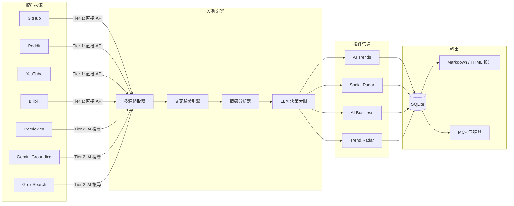

# Hermit Purple

**AI 趨勢研究與決策支援系統**

[](https://creativecommons.org/licenses/by-nc/4.0/)
[](https://www.python.org/)
[](https://github.com/AtsushiHarimoto/Moyin-Factory)

🌏 **語言:** [English](../README.md) | [日本語](README.ja.md) | [繁體中文](README.zh-TW.md)

Hermit Purple 是一款基於插件架構的 AI 趨勢研究工具。它從多個平台抓取資料，透過多引擎 AI 搜尋進行交叉驗證，並利用 LLM 合成結構化的情報週報。

專為需要掌握 AI 與技術快速趨勢變化的開發者和團隊而設計，讓你在資訊洪流中精準擷取真正重要的訊號。

---

## 架構



### 資料流程

1. **多源爬取** -- Tier 1（直接 API）與 Tier 2（AI 搜尋引擎）的資料來源並行查詢
2. **交叉驗證** -- 透過 URL 正規化、標題去重、多引擎引用計數產生信心分數
3. **LLM 分析** -- 每項結果由 Decision Brain（Gemini / Grok / Ollama）評估，給予 Adopt / Trial / Assess / Hold 判定，附帶證據摘要與風險備註
4. **情感萃取** -- 分析社群媒體留言中的商業信號（付費意願、痛點、需求信號）
5. **報告合成** -- AI「總編輯」生成包含執行摘要、關鍵趨勢、焦點工具的週報（Markdown 格式）

---

## 關鍵技術決策

| 決策 | 理由 |
|---|---|
| **插件架構** | 每個分析領域（AI Trends、Social Radar、AI Business、Trend Radar）皆為帶有事件回呼的獨立插件。只需繼承 `HermitPlugin` 即可新增管道，完全不需要修改核心程式碼。 |
| **階層式來源註冊表** | 來源分為 Tier 1（直接 API）、Tier 2（AI 搜尋引擎）、Tier 3（網頁爬蟲）。註冊表模式支援健康檢查與降級備援鏈。 |
| **跨引擎交叉驗證** | Perplexica、Gemini Grounding、Grok Search 的結果透過 URL 正規化與標題相似度進行交叉驗證。經 2 個以上引擎確認的項目獲得信心加成。 |
| **提示詞反指紋** | `PromptPermutator` 輪替角色設定、任務措辭、輸出格式指令，避免產生重複的 API 簽名。 |
| **速率限制防護** | 基於檔案鎖的 `UsageGuard` 以每日限額防止 API 成本失控，支援多行程安全。 |
| **韌性 AI 呼叫** | 雙路徑 LLM 存取：優先使用本地閘道（Web2API），閘道錯誤時自動降級至官方 Gemini/Grok API。 |
| **MCP 伺服器** | 將爬取、審計、報告、搜尋等所有功能以 MCP 工具形式暴露，可與 Claude、Stitch 及其他 MCP 客戶端整合。 |
| **SQLite + SQLAlchemy** | 零配置持久化搭配完整 ORM。透過唯一複合索引在資料庫層級強制資源去重。 |

---

## 快速開始

### 1. 安裝

```bash
git clone https://github.com/AtsushiHarimoto/hermit-purple.git
cd hermit-purple
python -m venv venv
source venv/bin/activate  # Windows: venv\Scripts\activate
pip install -r requirements.txt
```

### 2. 設定

複製環境變數範本檔並填入你的 API 金鑰：

```bash
cp .env.example .env
```

```ini
# .env
AI_BASE_URL=http://localhost:9009/v1     # 本地閘道或 OpenAI 相容端點
AI_API_KEY=your-ai-api-key-here
AI_MODEL=gemini-3.0-pro

GITHUB_TOKEN=your-github-token           # GitHub API 存取用
GEMINI_API_KEY=your-gemini-api-key-here  # 官方 Gemini API（降級備援用）
```

請檢視 `config.yaml` 以調整平台特定設定（子版塊、最低星數、關鍵字預設等）。

### 3. 執行

```bash
# 檢查系統健康狀態
python -m src.interface.cli health

# 列出可用的分析插件
python -m src.interface.cli list

# 執行 AI 趨勢分析
python -m src.interface.cli run ai_trends

# 多引擎降級備援的智慧網頁搜尋
python -m src.interface.cli search "latest AI agent frameworks 2025"

# 檢查搜尋鏈健康狀態（閘道、網路、Perplexity、Google）
python -m src.interface.cli search-health
```

### 4. MCP 伺服器

以 MCP 伺服器模式啟動，與 Claude Code 或其他 MCP 客戶端整合：

```bash
python -m src.mcp_server
```

可用 MCP 工具: `scrape_ai_trends`, `audit_resource`, `run_ai_curator`, `generate_weekly_report`, `discover_trending_keywords`, `smart_web_search`, `smart_web_health`

---

## 專案結構

```
hermit-purple/
|-- src/
|   |-- core/                # 核心引擎
|   |   |-- plugin.py        #   插件基底類別與管理器
|   |   |-- llm.py           #   LLM 決策大腦（判定評分）
|   |   |-- sentiment.py     #   商業信號萃取
|   |   |-- guard.py         #   速率限制防禦（基於檔案鎖）
|   |   |-- prompt_engine.py #   反指紋提示詞置換器
|   |   +-- config.py        #   Pydantic 設定與環境變數
|   |-- sources/             # 資料來源適配器
|   |   |-- registry.py      #   來源探索與階層管理
|   |   |-- cross_validator.py # 多引擎交叉驗證
|   |   |-- github.py        #   GitHub API 來源
|   |   |-- reddit.py        #   Reddit API 來源
|   |   |-- youtube.py       #   YouTube 來源
|   |   |-- bilibili.py      #   Bilibili 來源
|   |   |-- perplexica.py    #   Perplexica AI 搜尋（自架）
|   |   |-- gemini_grounding.py # Gemini Grounding
|   |   +-- grok_search.py   #   Grok 網頁搜尋
|   |-- plugins/             # 分析管道（自動探索）
|   |   |-- ai_trends/       #   AI/ML 趨勢追蹤
|   |   |-- social_radar/    #   社群媒體情感分析
|   |   |-- ai_business/     #   商業化與競爭者分析
|   |   +-- trend_radar/     #   新興技術雷達
|   |-- scrapers/            # 平台專用爬蟲
|   |-- pipelines/           # 管道基底與註冊表
|   |-- services/            # 智慧搜尋與內容審計
|   |-- report/              # Markdown/HTML 報告產生器（Jinja2）
|   |-- db/                  # SQLAlchemy 模型與工作階段管理
|   |-- interface/           # Typer CLI 應用程式
|   |-- infra/               # 爬蟲與儲存基礎設施
|   |-- mcp_server.py        # MCP 伺服器（FastMCP）
|   +-- config.py            # 應用層級設定載入器
|-- prompts/                 # LLM 提示詞模板（依管道分類）
|-- tests/                   # 單元與整合測試
|-- config.yaml              # 平台與管道設定
|-- requirements.txt         # Python 依賴套件
+-- .env.example             # 環境變數範本
```

---

## 透過插件進行擴展

1. 在 `src/plugins/your_plugin/` 下建立新目錄
2. 新增 `__init__.py`，匯出繼承自 `HermitPlugin` 的類別
3. 實作 `name`、`description` 屬性與 `run(context)` 方法
4. `PluginManager` 會在啟動時自動探索插件 -- 無需手動註冊

```python
from src.core.plugin import HermitPlugin, PipelineResult

class MyPlugin(HermitPlugin):
    @property
    def name(self) -> str:
        return "my_plugin"

    @property
    def description(self) -> str:
        return "自訂分析管道"

    def run(self, context: dict) -> PipelineResult:
        # 在此撰寫分析邏輯
        self.emit("status", "正在執行分析...")
        return PipelineResult(success=True, data={"result": "done"})
```

---

## 隸屬 Moyin 生態系

Hermit Purple 是 AI 視覺小說引擎生態系 [Moyin Factory](https://github.com/AtsushiHarimoto/Moyin-Factory) 的情報收集組件。

| 組件 | 角色 |
|---|---|
| **Moyin Factory** | 核心視覺小說引擎（Vue 3 + TypeScript） |
| **Hermit Purple** | AI 趨勢研究與決策支援（本倉庫） |
| **Moyin Gateway** | LLM API 閘道（Gemini / Grok 反向代理） |

---

## 授權

本專案採用 [CC BY-NC 4.0](../LICENSE)（創用CC 姓名標示-非商業性 4.0 國際）授權。

在適當標註出處的前提下，你可以自由分享與改編本作品，但僅限非商業用途。

---

*以 Python asyncio、SQLAlchemy、Typer、Pydantic、OpenAI SDK、FastMCP、Jinja2 建構。*
